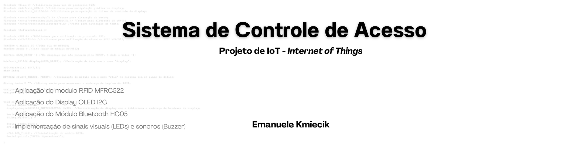

<p align="center">
  
</p>

> Projeto desenvolvido para controle de entrada e saída de pessoas utilizando RFID, com exibição em display OLED e comunicação via Bluetooth.
> 

---

## 📖 Sobre o Projeto

Este projeto consiste em um **Sistema de Controle de Acesso** utilizando Arduino, capaz de:

- Identificar usuários por meio de **cartões RFID**
- Registrar **entrada e saída**
- Diferenciar níveis de acesso:
    - 👤 Colaborador
    - 👔 Gerente
    - ❌ Cartão desconhecido
- Exibir informações em um **display OLED (I2C)**
- Enviar dados via **Bluetooth** para smartphone ou notebook
- Utilizar **LEDs e buzzer** para sinalização visual e sonora

---

## ⚙️ Funcionalidades

✔️ Leitura de cartões e TAGs RFID

✔️ Identificação por endereço hexadecimal (HEX)

✔️ Diferenciação de tipos de usuários

✔️ Controle de entrada e saída com validação

✔️ Exibição de dados no display OLED

✔️ Comunicação via Bluetooth (HC-05)

✔️ Feedback visual com LEDs

✔️ Feedback sonoro com buzzer

---

## 🧠 Regras de Negócio

- Apenas o cartão utilizado na **entrada** pode ser usado para registrar a **saída**
- O sistema identifica:
    - Cartão válido de colaborador
    - Cartão válido de gerente
    - Cartão desconhecido
- Cada ação gera:
    - Mensagem no display
    - Envio via Bluetooth
    - Sinal visual (LED)
    - Sinal sonoro (buzzer)

---

## 🧩 Componentes Utilizados

- Arduino UNO ou Mega 2560
- Módulo RFID MFRC522
- Display OLED I2C
- Módulo Bluetooth HC-05
- LEDs (verde e vermelho)
- Buzzer
- Resistores
- Jumpers (cabos de conexão)

---

## 🔌 Tecnologias Utilizadas

- Arduino (C/C++)
- Comunicação Serial
- Protocolo I2C
- Bluetooth (Serial)

---

## 📲 Comunicação Bluetooth

As informações exibidas no display também são enviadas via Bluetooth para:

- 📱 Smartphone (ex: Serial Bluetooth Terminal)
- 💻 Notebook (ex: PuTTY)

---

## 📺 Exemplo de Saída

```
Entrada autorizada
ID: A1 B2 C3 D4

Saída registrada
ID: A1 B2 C3 D4

Cartão desconhecido
ID: FF EE DD CC
```

---

## 🚨 Sinalizações

| Situação | LED | Buzzer |
| --- | --- | --- |
| Entrada/Saída válida | Verde | Som curto |
| Cartão desconhecido | Vermelho | Som de alerta |

---

## 📦 Estrutura do Projeto

```
📁 sistema-controle-acesso
 ┣ 📄 codigo.ino
 ┣ 📄 README.md
 ┣ 📁 imagens/
 ┗ 📁 videos/
```

---

## 🎯 Objetivo Acadêmico

Projeto desenvolvido como atividade prática com o objetivo de aplicar conceitos de:

- Sistemas embarcados
- Automação
- Integração de hardware
- Comunicação entre dispositivos

---

## 📸 Entrega

- Fotos do sistema em funcionamento
- Vídeos demonstrando o uso
- Código comentado e organizado

---

## 🚀 Melhorias Futuras

- Integração com banco de dados
- Interface web ou mobile
- Registro de logs em nuvem
- Sistema de autenticação mais robusto

---

## 👩‍💻 Autoria

**Emanuele Kmiecik**

Técnica em Desenvolvimento de Sistemas
